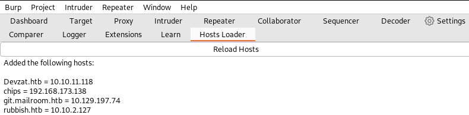

# Hosts Loader

Burp plugin to automatically load hosts from /etc/hosts (or the Windows equivalent) into Burp's project hostname resolution override.

## Why?

When I'm doing HackTheBox, changing my /etc/hosts doesn't seem to work for resolving things in Burp Suite. I assume they're cached in some way, but honestly it was quicker to write this then debug why this happens.

## How to use

Install the jar as you would any other extension. A new tab will appear, click reload, and hosts will be loaded.

